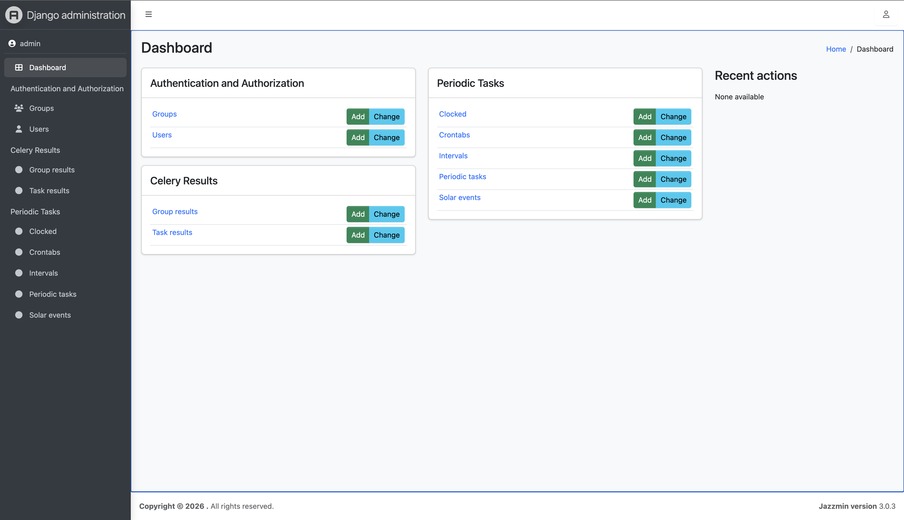

# django-project-template

Plantilla de proyecto Django con DRF, tema Jazzmin (admin), Celery, Redis, PostgreSQL, Prometheus, Grafana y librerías de Machine Learning.



## Stack tecnológico

- **Python 3.14** (imagen base Bookworm)
- **Django 5.2** con Django REST Framework
- **django-jazzmin** – tema de administración (AdminLTE 3 + Bootstrap 5)
- **Celery** – colas y tareas asíncronas (worker + beat)
- **Redis** – broker de Celery y caché
- **PostgreSQL 16** – base de datos
- **Prometheus** – métricas
- **Grafana** – dashboards y visualización de métricas

## Dependencias principales

### Web y API
- Django 5.2, djangorestframework, django-cors-headers
- django-crispy-forms, django-environ
- django-jazzmin (admin), django-redis

### Tareas y caché
- celery, django-celery-beat, django-celery-results
- redis

### Observabilidad
- django-prometheus

### Datos y ML
- polars, pandas, numpy
- scikit-learn, xgboost, lightgbm
- joblib, tqdm

### Base de datos
- psycopg2-binary

## Servicios Docker

| Servicio      | Contenedor        | Puerto | Descripción                    |
|---------------|-------------------|--------|--------------------------------|
| backend       | django-template-backend       | 8000   | Aplicación Django              |
| postgres      | django-template-postgres      | 5432   | Base de datos PostgreSQL       |
| redis         | django-template-redis         | 6379   | Redis (broker Celery / caché)  |
| celery        | django-template-celery-worker | -      | Worker de Celery               |
| celery-beat   | django-template-celery-beat   | -      | Planificador de tareas Celery  |
| prometheus    | django-template-prometheus    | 9090   | Servidor de métricas           |
| grafana       | django-template-grafana       | 3000   | Dashboards (admin/admin)       |

## Uso

1. **Variables de entorno**: Copiar `cp .env.example .env` y editar `.env` con los valores reales (contraseñas, `SECRET_KEY`, etc.). Todos los secretos y configuraciones sensibles se gestionan vía `.env`; el `docker-compose` los inyecta en los servicios.
2. La configuración de Prometheus está en `prometheus/prometheus.yml` (scrape del backend en `/metrics`). Opcional: añadir `grafana/provisioning` para datasources/dashboards.
3. Levantar los servicios:

   ```bash
   docker compose up -d
   ```

4. Accesos típicos:
   - App: http://localhost:8000
   - Admin Grafana: http://localhost:3000 (admin / admin)
   - Prometheus: http://localhost:9090

## Si falla la conexión a Postgres («password authentication failed»)

La contraseña de Postgres se define **solo la primera vez** que se crea el volumen. Si en `.env` tienes `POSTGRES_PASSWORD=postgres`, el backend y el contenedor postgres deben usar la misma.

- Si el volumen ya existía con la contraseña `postgres`, pon en `.env`: `POSTGRES_PASSWORD=postgres`.
- Si quieres cambiar de contraseña o no coincide: borra el volumen y vuelve a levantar para que Postgres se inicialice de nuevo con la de `.env`:

  ```bash
  docker compose down -v
  # Revisa .env (POSTGRES_PASSWORD y el usuario deben coincidir)
  docker compose up -d
  ```

## Gestión de memoria

El backend tiene límites y reservas de memoria (`mem_limit`, `mem_reservation`, `memswap_limit`) y variables de entorno para reducir fragmentación (`PYTHONMALLOC`, `MALLOC_ARENA_MAX`). El Dockerfile incluye optimizaciones de memoria y GC (`PYTHONGC`, `PYTHONHASHSEED`).
