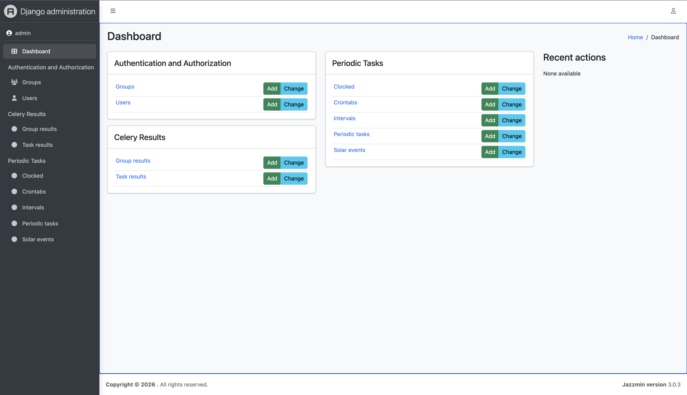

# django-project-template

Plantilla Django lista para desarrollo local y despliegue en producción, con sesiones multi-usuario, Celery, Redis, PostgreSQL, Prometheus y Grafana.



## Stack

| Pieza | Detalle |
|-------|---------|
| Python | 3.13 (Bookworm) |
| Django | 5.2.17 + DRF + Jazzmin |
| Tareas | Celery + django-celery-beat/results |
| Datos | PostgreSQL 16 + Redis 7 |
| Local | `runserver` en `:8000` (sin nginx ni WAF) |
| Producción | Gunicorn + WhiteNoise + **nginx** |
| Métricas | Prometheus + Grafana (en ambos profiles) |

## Profiles (`local` | `production`)

Solo hay **dos** profiles:

| Profile | Incluye | No incluye |
|---------|---------|------------|
| `local` | postgres, redis, backend, celery, beat, prometheus, grafana | nginx, WAF |
| `production` | lo mismo + **nginx** (puerto 80) | WAF |

### Arranque local

```bash
cp .env.example .env
# COMPOSE_PROFILES=local (ya viene en .env.example)
docker compose --profile local up -d --build
```

O con `COMPOSE_PROFILES=local` en `.env`:

```bash
docker compose up -d --build
```

| URL | Servicio |
|-----|----------|
| http://localhost:8000/admin/ | Django Admin |
| http://localhost:9090 | Prometheus |
| http://localhost:3000 | Grafana (admin/admin) |

### Arranque producción

En `.env`:

```env
COMPOSE_PROFILES=production
DJANGO_ENV=production
DEBUG=0
ENTRYPOINT_SCRIPT=entrypoint.prod.sh
```

```bash
docker compose --profile production up -d --build
```

Entrada HTTP recomendada: http://localhost (nginx → backend).

## Usuarios / sesiones simultáneas

- Sesiones en Redis + DB (`cached_db`): varios usuarios a la vez.
- En producción, Gunicorn con varios workers/threads (`GUNICORN_WORKERS`, `GUNICORN_THREADS`).
- Pool de conexiones Postgres (`DB_CONN_MAX_AGE`).
- Caché Redis compartida entre workers.

## Local vs producción

| | Local | Producción |
|---|--------|------------|
| Profile | `local` | `production` |
| `DJANGO_ENV` | `local` | `production` |
| `DEBUG` | `1` | `0` |
| `ENTRYPOINT_SCRIPT` | `entrypoint.sh` | `entrypoint.prod.sh` |
| HTTP | `:8000` directo | nginx `:80` → backend |
| nginx / WAF | No | Solo nginx |

## Dependencias

`requirements.txt` con versiones **fijadas**. Sin Polars. ML opcional comentado.

## Servicios

| Servicio | Contenedor | Puerto | Profiles |
|----------|------------|--------|----------|
| backend | django-template-backend | 8000 | local, production |
| postgres | django-template-postgres | 5432 | local, production |
| redis | django-template-redis | 6379 | local, production |
| celery | django-template-celery-worker | — | local, production |
| celery-beat | django-template-celery-beat | — | local, production |
| prometheus | django-template-prometheus | 9090 | local, production |
| grafana | django-template-grafana | 3000 | local, production |
| nginx | django-template-nginx | 80 | **solo production** |

## Buenas prácticas Docker

- Healthchecks y `depends_on` con `service_healthy`.
- Red `app_net`, usuario no-root en la imagen, secrets vía `.env`.
- Profiles: en local no se levanta nginx ni WAF.

## Exportar datos (Admin)

**django-import-export**: botón Export en `/admin/` (CSV, XLSX, JSON, …).

## Postgres: «password authentication failed»

```bash
docker compose down -v
docker compose --profile local up -d --build
```

## Actualizar desde el template

```bash
git remote add template https://github.com/TU-USUARIO/django-project-template.git
git fetch template
git merge template/main
```

## Estructura

```
├── docker-compose.yml      # profiles: local | production
├── Dockerfile
├── entrypoint.sh           # Local (runserver)
├── entrypoint.prod.sh      # Prod (gunicorn)
├── nginx/                  # Solo profile production
├── prometheus/
├── grafana/provisioning/
├── .env.example
└── requirements.txt
```
